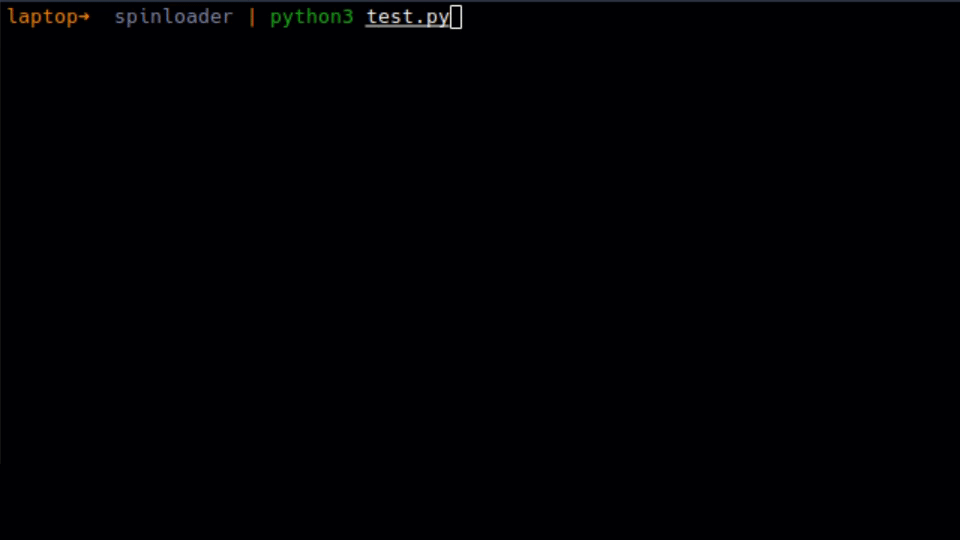

# Spinloader
###### A CLI animator that does a little more than just render animations
This is a project I've been working on over the weekend. It's a very simple project that'll show a spinloader for a running function. It's really simple to use. Just use the @animate decorator above the function and It'll take care of the rest. I also tried to incorporate some niche features that I often use myself.

1. Add timeouts to functions 
2. Render colored text on console. 

I'll keep working on making this better in the future. This won't work well on windows and, I've only tested it on linux.

Regardless,Here's a demo:



Here's the sample code 
```
from spinloader import animate, TextColor
from spinloader.exceptions import ThreadTimeoutError

import time 


@animate(TextColor.green("Printing Messages "),timeout=5)
def hello():
    print(TextColor.yellow("Hello world!"))
    time.sleep(0.5)
    return 100

try:
    print(hello())
except Exception as e:
    print(e)

```
PS: I've just started working on this. So, expect bugs. Also, feel free to contribute. Thanks! 